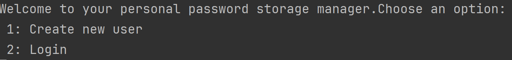
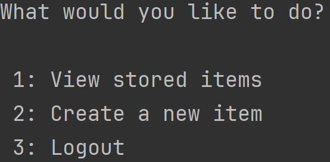
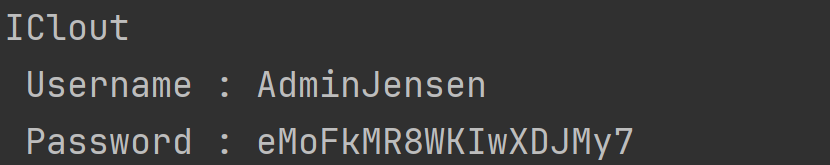

# Password Manager Console app made in .NET

## How to run

 -  The app has been developed in JetBrains Rider. The easiest way to get it up and running, is simply to right-click the PasswordStorageManager and run it. 

### Login 
 - You can either create a new user or use my existing user.
 - Existing user/pass combo = AdminJensen123/HitMedSangen2!

# The app itself:
On spinning up the app you will be greeted by a choice looking like this:

As mentioned you can login with the exising user, or make your own new user.
Logging in puts you on the main menu of the app where you are given three choices:

The options are pretty self explanatory; you can view your already stored items, create a new item or Logout.

Viewing stored items produces a list in the console listing your items with their passwords in plaintext:

# Discussion
As presented in the video by Computerphile Password managers are becoming more popular, and many security managers recommend using them due to their ease-of-use and convenience.
In this project we were tasked with creating a password manager or vault for securely storing passwords.

In this App I have tried to implement the best practices I know.

When attempting to create a new user, the password for the given user must meet certain requirements, such as being at least 8 chars and contain both a number, a capital, and a normal letter, or any combination of the three.
This is to ensure that the master password also has some strength to it. After all a chain is only as strong as its weakest link.

Another way to increase security after user creation could be to enforce a 2-factor authentication through email/phone/app etc.
This is beyond the scope of this project though.

Before the password is stored it goes through a cryptographic pipeline consisting of the following steps:
 - a unique salt is generated using the users credentials.
 - An instance of the Rfc2898DeriveBytes class is used for key derivation and deriving a cryptographic key from the users password and the salt.
 - Lastly a password hash is generated.

The Salt is also used to encrypt and decrypt passwords to and from the vault, providing an extra layer of security by ensuring that no passwords can be viewed as plaintext without the owners unique salt.
Robust hashing algorithms and key derivation methods are employed to guarantee the secure storage of data, denying any unauthorized access to plaintext passwords.
The database itself is also split up into sections, so access to one collection doesnt provide full access to the rest of the database.

I think the biggest security flaw of my app is the database. MongoDB has been used as the database, 
and while MongoDB does have guards, authentication, authorization etc. I haven't implemented them as time was of the essence.
I did provide schemas for the MongoDB driver which at least structurizes the data and prevents non-specific malicious attacks on the DB, like trying to send a script for example.
